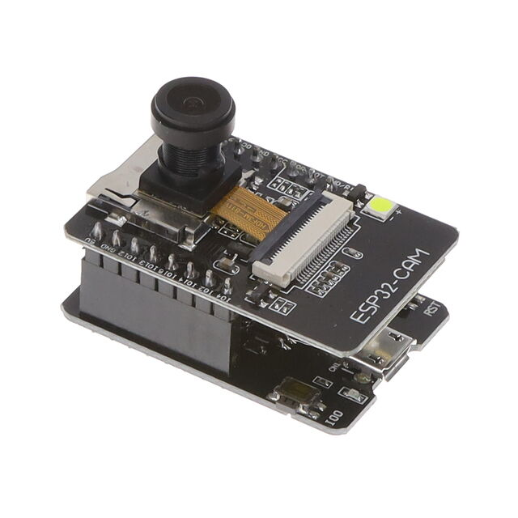

# คู่มืออบรม: การใช้อุปกรณ์ ESP32-CAM และ Deep Learning สำหรับ CUBESAT
## 1. เตรียม python environtment ด้วย Conda
การใช้ Conda ช่วยให้จัดการแพ็กเกจและสภาพแวดล้อมของ Python ได้สะดวก โดยเฉพาะเมื่อต้องใช้ไลบรารีที่มีการอ้างอิงซับซ้อน เช่น FastAPI และ YOLO (Ultralytics)

### 1.1 ติดตั้ง Conda
ดาวน์โหลด Miniconda หรือ Anaconda ตามระบบปฏิบัติการจากหน้าเว็บทางการ

ติดตั้งตามขั้นตอนที่ตัวติดตั้งแนะนำ

<!-- list -->
- หากใช้ Linux/Mac สามารถใช้ไฟล์ .sh
- หากใช้ Windows ใช้ไฟล์ .exe

เมื่อติดตั้งเสร็จ เปิดเทอร์มินัล/Command Prompt ใหม่ เพื่อให้คำสั่ง conda พร้อมใช้งาน

### 1.2 สร้างและใช้งานสภาพแวดล้อม
สร้าง environment ชื่อ esp32cam พร้อม Python 3.10

```bash
conda create -n fastapi python=3.10
```
เปิดใช้งาน environment

```bash
conda activate fastapi
```
เมื่อเปิดใช้งานสำเร็จ ชื่อ environment จะปรากฏหน้าพรอมต์ (เช่น (fastapi))

### 1.3 ติดตั้งไลบรารีหลัก
FastAPI และ Uvicorn (ใช้ช่อง conda-forge เพื่อเวอร์ชันล่าสุด)

```bash
conda install fastapi uvicorn -c conda-forge
```
OpenCV (จำเป็นสำหรับการบันทึกและแสดงผลภาพ)

```bash
conda install opencv -c conda-forge
```
YOLO (Ultralytics) – ไม่มีแพ็กเกจ conda อย่างเป็นทางการ จึงติดตั้งผ่าน pip ภายใน environment

```bash
pip install ultralytics
```
ตรวจสอบว่าไลบรารีทั้งหมดติดตั้งครบ

```bash
python -c "import fastapi, cv2, ultralytics; print('OK')"
```


## 2. สร้าง FastAPI สำหรับเก็บข้อมูล image
- สร้างโครงสร้างโฟลเดอร์: main.py, images/, static/
```cpp
fastapi/
├── main.py          # แอปหลัก
├── images/          # โฟลเดอร์เก็บภาพที่อัปโหลด
├── static/          # หน้าเว็บ front-end
└── yolo11n.pt       # โมเดล YOLO ใช้วิเคราะห์รูป
```
- สร้างโฟลเดอร์ images/ และ static/ เพื่อเก็บภาพและไฟล์เว็บสเตติก
```bash
mkdir images static
```

สร้างไฟล์ main.py ด้วยโค้ดดังนี้:
```python
from fastapi import FastAPI, File, UploadFile
from fastapi.responses import HTMLResponse
from fastapi.staticfiles import StaticFiles
import shutil
import os

app = FastAPI()

app.mount("/web", StaticFiles(directory="static"), name="static")

@app.get("/api")
def read_root():
    return {"Hello": "World"}
```

- เพิ่มฟังก์ชันเพื่ออัปโหลดและเก็บภาพ

สร้าง API:

- รับและบันทึกรูป
    - endpoint: POST /upload

```python
@app.post("/upload")
async def upload_image(request: Request):
    image_bytes = await request.body()
    timestamp = int(time.time())
    file_path = f"images/image_{timestamp}.jpg"
    with open(file_path, "wb") as f:
        f.write(image_bytes)
    return {"message": "Image uploaded successfully at " + str(timestamp)}

```

- คืนรายการไฟล์ทั้งหมดในโฟลเดอร์ images
    - endpoint: GET /images

```python
@app.get("/images")
def list_images():
    print("dd")
    image_files = os.listdir("images")
    return {"images": image_files}
```

- รันเซิร์ฟเวอร์ด้วย 
```bash
uvicorn main:app --reload --host 0.0.0.0 --port 8000
```

- ทดลองอัพโหลดภาพผ่าน API ด้วย REST Client
```bash
### upload image
POST http://localhost:8000/upload
Content-Type: application/octet-stream
Accept: application/json

< ./test2.jpg

```

- ทดลองเรียกภาพ ด้วย REST Client
```bash
### list images
GET http://localhost:8000/images
Accept: application/json

```

### 2. การใช้งาน ESP32‑CAM
### 3.1 เชื่อมต่อฮาร์ดแวร์
อุปกรณ์หลัก:
- โมดูล ESP32‑CAM
- USB‑to‑TTL (FTDI/CP2102/CH340)
- สาย jumper 6 เส้น

การต่อสายพื้นฐาน:
<!-- table -->
| ESP32-CAM Pin | USB‑TTL Pin |
|----------------|-------------|
| U0R            | TX          |
| U0T            | RX          |
| GND            | GND         |
| 5V             | 5V          |


<!-- show image from url -->



- เข้าสู่โหมดแฟลช: กดปุ่ม GPIO0 หรือจัมเปอร์ IO0→GND แล้วกด RST (หรือจ่ายไฟใหม่)

### 3.2 ตั้งค่า Arduino IDE
- ติดตั้ง Arduino IDE ดาวน์โหลดจาก [เว็บไซต์ Arduino](https://www.arduino.cc/en/software)
- เปิด Arduino IDE และไปที่ Preferences
- เพิ่ม URL ของบอร์ด ESP32 ใน Additional Board Manager URLs
   https://dl.espressif.com/dl/package_esp32_index.json
- เพิ่มบอร์ด ESP32 จาก Board Manager
  - ค้นหา "esp32"
  - ติดตั้งบอร์ด ESP32 by Espressif Systems

- เลือกบอร์ด ESP32‑CAM จาก Tools > Board > ESP32 Arduino > AI Thinker ESP32-CAM
- ตั้งค่าพอร์ต (Tools > Port) ให้ตรงกับพอร์ตที่เชื่อมต่อ USB‑TTL

### 3.3 ทดลองเขียนโค้ด
- เขียนโค้ด print hello ทุกๆ 30 วินาที
```cpp
#include "esp_camera.h"
#include <WiFi.h>
#include <HTTPClient.h>

void setup() {
  Serial.begin(115200);
  delay(1000);
  Serial.println("Hello");
}

void loop() {
  delay(30000);
  Serial.println("Hello");
}
```
- อัปโหลดโค้ดไปยังบอร์ดและทดสอบผ่าน Serial Monitor

### 3.4 เขียนโค้ดถ่ายภาพ
- เขียนโค้ดถ่ายภาพแล้วส่งผ่าน HTTP POST ไปยังเซิร์ฟเวอร์ (/upload)

```cpp
#include "esp_camera.h"
#include <WiFi.h>
#include <HTTPClient.h>

const char* ssid = "YOUR_WIFI_SSID";
const char* password = "YOUR_WIFI_PASSWORD";
const char* serverUrl = "http://<server-ip>:8000/upload"; // FastAPI endpoint

// กำหนดพินตามโมดูล AI-Thinker
#define PWDN_GPIO_NUM     32
#define RESET_GPIO_NUM    -1
#define XCLK_GPIO_NUM      0
#define SIOD_GPIO_NUM     26
#define SIOC_GPIO_NUM     27
#define Y9_GPIO_NUM       35
#define Y8_GPIO_NUM       34
#define Y7_GPIO_NUM       39
#define Y6_GPIO_NUM       36
#define Y5_GPIO_NUM       21
#define Y4_GPIO_NUM       19
#define Y3_GPIO_NUM       18
#define Y2_GPIO_NUM        5
#define VSYNC_GPIO_NUM    25
#define HREF_GPIO_NUM     23
#define PCLK_GPIO_NUM     22

void startCameraServer() {}

void setup() {
  Serial.begin(115200);
  camera_config_t config;
  config.ledc_channel = LEDC_CHANNEL_0;
  config.ledc_timer = LEDC_TIMER_0;
  config.pin_d0 = Y2_GPIO_NUM;
  config.pin_d1 = Y3_GPIO_NUM;
  config.pin_d2 = Y4_GPIO_NUM;
  config.pin_d3 = Y5_GPIO_NUM;
  config.pin_d4 = Y6_GPIO_NUM;
  config.pin_d5 = Y7_GPIO_NUM;
  config.pin_d6 = Y8_GPIO_NUM;
  config.pin_d7 = Y9_GPIO_NUM;
  config.pin_xclk = XCLK_GPIO_NUM;
  config.pin_pclk = PCLK_GPIO_NUM;
  config.pin_vsync = VSYNC_GPIO_NUM;
  config.pin_href = HREF_GPIO_NUM;
  config.pin_sscb_sda = SIOD_GPIO_NUM;
  config.pin_sscb_scl = SIOC_GPIO_NUM;
  config.pin_pwdn = PWDN_GPIO_NUM;
  config.pin_reset = RESET_GPIO_NUM;
  config.xclk_freq_hz = 20000000;
  config.pixel_format = PIXFORMAT_JPEG;
  config.frame_size = FRAMESIZE_SVGA;
  config.jpeg_quality = 12;
  config.fb_count = 1;

  esp_err_t err = esp_camera_init(&config);
  if (err != ESP_OK) {
    Serial.printf("Camera init failed: %s\n", esp_err_to_name(err));
    return;
  }

  WiFi.begin(ssid, password);
  while (WiFi.status() != WL_CONNECTED) {
    delay(500);
    Serial.print(".");
  }
  Serial.println("WiFi connected");
}

void sendImage() {
  camera_fb_t* fb = esp_camera_fb_get();
  if (!fb) {
    Serial.println("Camera capture failed");
    return;
  }

  HTTPClient http;
  http.begin(serverUrl);
  http.addHeader("Content-Type", "image/jpeg");

  int httpResponseCode = http.POST(fb->buf, fb->len);
  if (httpResponseCode > 0) {
    Serial.printf("Image sent, response: %d\n", httpResponseCode);
  } else {
    Serial.printf("Failed sending image, error: %s\n", http.errorToString(httpResponseCode).c_str());
  }

  http.end();
  esp_camera_fb_return(fb);
}

void loop() {
  sendImage();
  delay(10000); // ส่งทุก 10 วินาที
}
```
- อัปโหลดโค้ดไปยังบอร์ดและทดสอบผ่าน Serial Monitor


## 4. การตรวจสอบวัตถุในภาพ
- ดาวน์โหลดโมเดล YOLO จาก [ที่นี่](https://github.com/AlexeyAB/darknet/releases)
- แตกไฟล์และวางโมเดลในโฟลเดอร์โปรเจกต์

- เรียกใช้งานโมเดล
```python
from fastapi import FastAPI, Request, Query, HTTPException
from fastapi.responses import JSONResponse, Response
from fastapi.staticfiles import StaticFiles
# เพิ่มการใช้งาน YOLO
from ultralytics import YOLO
import numpy as np
import cv2
import time
import os


model = YOLO("yolo11n.pt")  # เปลี่ยนเป็นโมเดลที่ต้องการใช้

```

- เขียน API วิเคราะห์วัตถุด้วย YOLO
    - endpoint: GET /infer/{image}?render=true|false

```python
def run_infer_from_file(image_path: str):
    """Load image from file and run inference"""
    if not os.path.exists(image_path):
        raise HTTPException(
            status_code=404, detail=f"Image file not found: {image_path}")

    img = cv2.imread(image_path)
    if img is None:
        raise HTTPException(
            status_code=400, detail=f"Could not read image file: {image_path}")

    results = model.predict(source=img, imgsz=640, conf=0.25, verbose=False)
    return img, results[0]


@app.get("/infer/{image_name}")
async def infer_by_name(
    image_name: str,
    render: bool = Query(
        False, description="true = ส่งคืนรูปภาพ JPEG ที่ตีกรอบ")
):
    image_path = os.path.join("images", image_name)
    _, r = run_infer_from_file(image_path)

    if render:
        annotated = r.plot(line_width=2, labels=True, conf=True)
        ok, buf = cv2.imencode(".jpg", annotated)
        if not ok:
            return Response(status_code=500, content="Failed to encode image")
        return Response(
            content=buf.tobytes(),
            media_type="image/jpeg",
            headers={"Content-Disposition": "inline; filename=annotated.jpg"}
        )

    # คืน JSON
    dets = []
    names = r.names
    for b in r.boxes:
        x1, y1, x2, y2 = map(float, b.xyxy[0].tolist())
        cls_id = int(b.cls[0])
        conf = float(b.conf[0])
        dets.append({"bbox": [x1, y1, x2, y2], "cls_id": cls_id,
                     "cls_name": names[cls_id], "conf": conf})
    return JSONResponse({"detections": dets, "image_shape": r.orig_shape})

```

- ทดลองเรียกใช้ API ด้วย ResClient

```bash
### JSON response
GET http://localhost:8000/infer/images.jpg

### Rendered image response
GET http://localhost:8000/infer/images.jpg?render=true
```

## 5.สร้าง front‑end สำหรับเรียกดูภาพ
- สร้างหน้า static/index.html 
- เพิ่ม Bootstrap 

```html
<!DOCTYPE html>
<html lang="en">
<head>
    <meta charset="UTF-8">
    <meta name="viewport" content="width=device-width, initial-scale=1.0">
    <title>Document</title>
    <link href="https://cdn.jsdelivr.net/npm/bootstrap@5.3.8/dist/css/bootstrap.min.css" rel="stylesheet"
        integrity="sha384-sRIl4kxILFvY47J16cr9ZwB07vP4J8+LH7qKQnuqkuIAvNWLzeN8tE5YBujZqJLB" crossorigin="anonymous">
    <script src="https://cdn.jsdelivr.net/npm/bootstrap@5.3.8/dist/js/bootstrap.bundle.min.js"
        integrity="sha384-FKyoEForCGlyvwx9Hj09JcYn3nv7wiPVlz7YYwJrWVcXK/BmnVDxM+D2scQbITxI"
        crossorigin="anonymous"></script>
</head>
<body>
    <div class="container mt-5">
        <div class="row">
            <div class="col-sm-4">
                <div class="card">
                    <div class="card-body">
                        <h5 class="card-title">Image List</h5>
                        <ul id="image-list">
                        </ul>
                    </div>
                </div>
            </div>
            <div class="col-sm-8">
                <div class="card">
                    <div class="card-body">
                        
                    </div>
                </div>
            </div>
        </div>
    </div>
</body>
<script>
    // เขียนฟังก์ชัน JavaScript สำหรับโหลดภาพ ตรงนี้
</script>
</html>
```

- เขียน function สำหรับแสดงชื่อภาพ ด้วย GET /images
```js
async function fetchImages() {
        const response = await fetch("/images");
        const data = await response.json();
        const imageList = document.getElementById("image-list");
        imageList.innerHTML = "";
        data.images.forEach(image => {
            console.log(image);

            const li = document.createElement("li");
            li.textContent = image;
            li.onclick = () => selectImage(image);
            imageList.appendChild(li);
        });
    }
```

- เขียน function สำหรับแสดงภาพจากการตรวจจับวัตถุ โดยโหลดภาพผลลัพธ์จากภาพ ด้วย GET /infer/{name}?render=true
```js
function selectImage(imageName) {
        const selectedImage = document.getElementById("selected-image");
        selectedImage.src = `/infer/${imageName}?render=true`;
    }
```
- เรียกใช้งาน function  
```js
window.onload = fetchImages;
```

- เปิดเบราว์เซอร์ที่ http://<ip>:8000/web/ เพื่อทดสอบการแสดงผล

## 6. การฝึกสอนโมเดล (Training the Model)

ในขั้นตอนนี้เราจะทำการฝึกสอนโมเดล YOLOv11 ด้วยข้อมูลที่เตรียมไว้ โดยใช้สคริปต์การฝึกสอนที่มีอยู่ในไลบรารี Ultralytics
- สร้างไฟล์ custom_train.ipynb
- เข้าถึงโฟลเดอร์ภาพและแสดงตัวอย่าง

```python
import os
import matplotlib.pyplot as plt
import cv2

train_img_dir = './cars/train/images'
img_files = [f for f in os.listdir(train_img_dir) if f.lower().endswith(('.jpg', '.jpeg', '.png'))]

# Display first 5 images
plt.figure(figsize=(15, 5))
for i, img_file in enumerate(img_files[:6]):
    img_path = os.path.join(train_img_dir, img_file)
    img = cv2.imread(img_path)
    img = cv2.cvtColor(img, cv2.COLOR_BGR2RGB)
    plt.subplot(2, 3, i+1)  # Adjust the grid to 2 rows and 3 columns
    plt.imshow(img)
    # plt.title(img_file)
    plt.axis('off')
plt.show()
```

- โหลดโมเดล YOLOv11 
- ระบุโฟลเดอร์ที่เก็บข้อมูลสำหรับ training
- กำหนดพารามิเตอร์การฝึกสอน

```python
from ultralytics import YOLO

model = YOLO('yolo11n.pt')  # Load pre-trained YOLOv11 model

# Start training
results = model.train(
    data='./cars/data.yaml',
    epochs=20,
    imgsz=640,
    batch=16,
    project='yolo11_custom_train',
    name='exp',
    exist_ok=True,
    device='cpu'  # 0, 'cpu', 'mps'
)

print('Training complete!')
```

- เข้าถึงโมเดลที่ผ่านการฝึกสอนมาแล้ว
- นำไปใช้งานในการตรวจจับวัตถุกับภาพใหม่

```python
# Show predictions with box on test set images
import glob
from PIL import Image
import numpy as np

# Load the trained model (update path if you have a best.pt from training)
model = YOLO('yolo11_custom_train/train/weights/best.pt') 

test_img_dir = './cars/test/images'
test_img_files = glob.glob(os.path.join(test_img_dir, '*'))

num_imgs = min(6, len(test_img_files))
plt.figure(figsize=(8, num_imgs * 4))
for i, img_path in enumerate(test_img_files[:num_imgs]):
    results = model(img_path)
    # If ultralytics >=8.0.0, results[0].plot() returns an array with boxes drawn
    result_img = results[0].plot() if hasattr(results[0], 'plot') else np.array(Image.open(img_path))
    plt.subplot(num_imgs, 1, i+1)
    plt.imshow(result_img)
    plt.title(os.path.basename(img_path))
    plt.axis('off')
plt.tight_layout()
plt.show()
```

## สรุป
Conda environment ช่วยให้ติดตั้งและจัดการ FastAPI + YOLO อย่างเป็นระบบ

ESP32‑CAM ส่งภาพแบบ POST ไปยัง API

FastAPI รับภาพ เก็บไว้ และวิเคราะห์ด้วย YOLO

Front‑End โหลดรูปจาก API และแสดงผล
